# Azure Machine Learning - LoRA Fine-tuning for Small Language Models

Fine-tune open-source small language models using LoRA on Azure Machine Learning Studio with the Databricks Dolly 15K dataset.

## Overview

- **Model**: Microsoft Phi-4-mini-instruct (3.8B parameters, 128K context)
- **Dataset**: Databricks Dolly 15K (15,011 human-generated instruction-response pairs)
- **Method**: LoRA (Low-Rank Adaptation) with 4-bit quantization
- **Platform**: Azure Machine Learning Studio

## 🎯 Features

- ✅ Parameter-efficient fine-tuning with LoRA
- ✅ 4-bit quantization for memory efficiency (~5GB GPU memory)
- ✅ Databricks Dolly 15K dataset (8 instruction categories)
- ✅ Model comparison script (base vs fine-tuned)
- ✅ Azure ML integration with MLflow tracking
- ✅ Training time: ~1-2 hours on V100

## 🏗️ Architecture & Flow

```mermaid
graph TB
    subgraph Local["💻 Local Development"]
        A["📝 Configuration Files<br/>training_config.yaml<br/>compute_config.yaml"]
        B["🐍 Training Scripts<br/>train.py / train_cpu.py"]
        C["📊 Job Submission<br/>submit_training_job.py"]
    end
    
    subgraph Azure["☁️ Azure Machine Learning"]
        D["🖥️ Compute Management<br/>• Create/Start VM<br/>• GPU: Standard_NC6s_v3<br/>• CPU: Standard_E4ds_v4"]
        E["🔧 Environment Setup<br/>• Install dependencies<br/>• Load model & dataset<br/>• Configure LoRA"]
        F["🚀 Training Execution<br/>• Fine-tune with LoRA<br/>• Track with MLflow<br/>• Save checkpoints"]
        G["💾 Model Registry<br/>• Store fine-tuned model<br/>• Version management<br/>• Deployment ready"]
        H["📈 Monitoring<br/>• Training metrics<br/>• Resource usage<br/>• Cost tracking"]
    end
    
    subgraph Data["📚 External Resources"]
        I["🤗 HuggingFace<br/>• Phi-4-mini-instruct<br/>• Dolly 15K dataset"]
    end
    
    A --> C
    B --> C
    C -->|"1. Submit Job"| D
    D -->|"2. Provision VM"| E
    E -->|"3. Download"| I
    E -->|"4. Start Training"| F
    F -->|"5. Log Metrics"| H
    F -->|"6. Save Model"| G
    G -->|"7. Shutdown VM"| D
    
    style Local fill:#e1f5ff
    style Azure fill:#fff4e1
    style Data fill:#f0f0f0
```



**Azure ML Role:** Manages the complete training lifecycle:
1. **Compute Provisioning**: Creates/starts VMs based on your config
2. **Environment Setup**: Installs Python packages and dependencies
3. **Resource Management**: Downloads models and datasets from HuggingFace
4. **Training Orchestration**: Executes training scripts on remote compute
5. **Monitoring**: Tracks metrics, logs, and resource usage via MLflow
6. **Cost Optimization**: Automatically stops VMs when training completes

## Project Structure

```
root/
├── src/
│   ├── train.py                 # Fine-tuning script
│   ├── evaluate.py              # Evaluation script
│   ├── compare_models.py        # Compare base vs fine-tuned
│   └── utils.py                 # Utility functions
├── jobs/
│   ├── submit_training_job.py   # Azure ML training job
│   └── submit_eval_job.py       # Azure ML evaluation job
├── config/
│   ├── training_config.yaml     # Training configuration
│   └── compute_config.yaml      # Azure ML compute config
└── environment/
    ├── conda.yaml               # Conda environment
    └── requirements.txt         # Python dependencies
```

## Dataset: Databricks Dolly 15K

High-quality dataset with 15,011 human-generated instruction-response pairs across 8 categories:

- **Open QA**: General knowledge questions
- **Closed QA**: Questions with reference text
- **Brainstorming**: Creative idea generation
- **Classification**: Categorize items
- **Summarization**: Summarize text
- **Information Extraction**: Extract specific info
- **Creative Writing**: Open-ended writing
- **General QA**: Other question-answering tasks

License: CC BY-SA 3.0 (commercial use allowed)

**Local Sample Files:**
- `data/train.jsonl` - 20 sample examples from Dolly dataset
- `data/validation.jsonl` - 5 sample examples from Dolly dataset
- `data/databricks-dolly-15k.jsonl.zip` - Full dataset (15,011 examples)

> 💡 **Note**: Training scripts automatically download the full dataset from HuggingFace. Local files are provided for reference and testing purposes only.

## 📋 Prerequisites

- Azure subscription with Azure Machine Learning workspace
- Azure ML compute: **GPU (Standard_NC6s_v3)** OR **CPU (Standard_E4ds_v4)**
- Python 3.9+

## 📦 Installation

### Option 1: Fast Installation with uv ⚡ (Recommended)

[uv](https://github.com/astral-sh/uv) is 10-100x faster than pip, written in Rust by Astral.

**Windows (PowerShell):**
```powershell
.\scripts\generate_requirements_uv.ps1
```

**Linux/Mac (Bash):**
```bash
chmod +x scripts/generate_requirements_uv.sh
./scripts/generate_requirements_uv.sh
```

### Option 2: Standard pip Installation

**Windows (PowerShell):**
```powershell
.\scripts\generate_requirements.ps1
```

> 💡 **Note**: The scripts automatically generate `requirements.txt` and `conda.yaml` with your installed versions. Azure ML uses these files to setup the remote training environment.

## 🚀 Quick Start

### 1. Setup Environment

```powershell
# Fast installation with uv (recommended)
.\scripts\generate_requirements_uv.ps1

# Or standard pip installation
.\scripts\generate_requirements.ps1

# Verify setup
python setup.py
```

### 2. Configure Azure ML

```bash
# Copy environment template
cp .env.template .env

# Edit .env with your Azure details:
# AZURE_SUBSCRIPTION_ID=<your-subscription-id>
# AZURE_RESOURCE_GROUP=<your-resource-group>
# AZURE_WORKSPACE_NAME=<your-workspace-name>
```

### 3. Submit Training Job

**Option A: GPU Training (Fast, Full Dataset)**
```bash
cd jobs
python submit_training_job.py
```
- Uses Standard_NC6s_v3 (V100 GPU)
- Trains on full 15K samples
- ~1-2 hours, ~$1.80 total cost

**Option B: CPU Training (No GPU Required)**
```bash
cd jobs
python submit_training_job_cpu.py
```
- Uses Standard_E4ds_v4 (4 cores, 32GB RAM)
- Trains on 1K samples subset
- ~2-4 hours, ~$1.16 total cost

### 4. Monitor & Compare

```bash
# Job runs in Azure ML Studio - check URL from submission output

# After training completes, compare models
python src/compare_models.py --adapter_path ./outputs/final_model
```

## Usage

### 1. Train on Azure ML

**GPU Training** (faster, full dataset):
```bash
python jobs/submit_training_job.py
```

**CPU Training** (no GPU required):
```bash
python jobs/submit_training_job_cpu.py
```

Training automatically:
- Downloads Databricks Dolly 15K dataset
- Splits into train/validation
- Converts to chat format
- Trains with LoRA
- Tracks metrics with MLflow

### 2. Compare Base vs Fine-tuned Model

```bash
python src/compare_models.py --adapter_path ./outputs/final_model
```

Tests 5 sample queries on both models:
- What is machine learning?
- Explain supervised vs unsupervised learning
- How do neural networks work?
- What are benefits of cloud computing?
- Describe natural language processing

Custom queries:
```bash
python src/compare_models.py \
    --adapter_path ./outputs/final_model \
    --queries "Explain quantum computing" "What is DevOps?"
```

### 3. Evaluate Fine-tuned Model

```bash
python jobs/submit_eval_job.py --model_path ./outputs/final_model
```

Metrics: perplexity, ROUGE scores, generation quality, latency

### 4. Local Training (Optional)

**GPU:**
```bash
python src/train.py --output_dir ./outputs --max_samples 100
```

**CPU:**
```bash
python src/train_cpu.py --output_dir ./outputs_cpu --max_samples 100
```

## ⚙️ Configuration

### GPU Training (`config/training_config.yaml`)

```yaml
model:
  name: "microsoft/Phi-4-mini-instruct"

data:
  dataset_name: "databricks/databricks-dolly-15k"
  max_samples: null  # Full dataset

lora:
  r: 16              # Standard LoRA rank
  lora_alpha: 32

training:
  batch_size: 4
  max_seq_length: 512
```

### CPU Training (`config/training_config_cpu.yaml`)

```yaml
model:
  name: "microsoft/Phi-4-mini-instruct"

data:
  dataset_name: "databricks/databricks-dolly-15k"
  max_samples: 1000  # Subset for faster CPU training

lora:
  r: 8               # Reduced for CPU
  lora_alpha: 16

training:
  batch_size: 1
  gradient_accumulation_steps: 16  # Effective batch = 16
  max_seq_length: 256              # Reduced for CPU
```

## Model Details

**Phi-4-mini-instruct**
- Parameters: 3.8B
- Context: 128K tokens
- Vocabulary: 200K tokens
- Architecture: Grouped-query attention
- License: MIT

**LoRA Configuration**

| Setting | GPU | CPU |
|---------|-----|-----|
| LoRA rank | 16 | 8 |
| Trainable params | ~8.4M | ~4.2M |
| Memory (GPU) | ~5GB | N/A |
| Memory (CPU) | N/A | ~16GB |
| Training time | 1-2 hours | 2-4 hours |
| Dataset size | 15K samples | 1K samples |
| Quantization | 4-bit | None |

## ⚠️ Important Notes

### Known Issues & Limitations

**Script Issues:**
1. **`submit_training_job_cpu.py`**: Uses `MLClient.from_config()` requiring `config.json` in project root - may fail if file missing
2. **`utils.py`**: `validate_jsonl_format()` expects chat format with "messages" field, but local files use Dolly format - validation may show errors even though training works (auto-converts format)
3. **`setup.py`**: Basic error handling without proper exception details - dependency check failures may not show clear messages

**Data Handling:**
- Local sample files (`train.jsonl`, `validation.jsonl`) use Dolly format: `{instruction, context, response, category}`
- Training scripts automatically download from HuggingFace and convert to chat format
- Validation errors from `setup.py` can be ignored if training scripts run successfully

**Azure ML Requirements:**
- Scripts designed for Azure ML only - local execution requires significant modifications
- Requires active Azure subscription with ML workspace configured
- HuggingFace model/dataset downloads need internet access from compute nodes
- Compute must be created before job submission (scripts don't auto-create)

**Cost Considerations:**
- GPU: ~$0.90/hour (Standard_NC6s_v3) = ~$1.80 for full training
- CPU: ~$0.29/hour (Standard_E4ds_v4) = ~$0.58-$1.16 for subset training
- Storage costs apply for model outputs (~20MB LoRA adapters)
- Always configure auto-shutdown to avoid idle compute charges

### Expected Training Results

**GPU Training (15K samples):**
- Final Training Loss: ~1.5-2.0
- Final Validation Loss: ~1.8-2.2
- Trainable Parameters: ~8.4M (LoRA rank 16)
- GPU Memory: ~5GB (4-bit quantization)
- Duration: 1-2 hours
- Quality: Production-ready fine-tuned model

**CPU Training (1K samples):**
- Final Training Loss: ~2.0-2.5
- Final Validation Loss: ~2.2-2.8  
- Trainable Parameters: ~4.2M (LoRA rank 8)
- RAM Usage: ~16GB (no quantization)
- Duration: 2-4 hours
- Quality: Testing/prototype model (lower quality than GPU)

## Best Practices

### Development Workflow

1. **Local Testing First**: Use small sample (100 examples) locally before Azure ML
2. **Validate Data**: Run `python setup.py` to check environment and data format
3. **Start with CPU**: Test job submission with CPU config before expensive GPU runs
4. **Monitor Costs**: Check Azure ML Studio for compute costs and set budget alerts

### Training Optimization

**GPU Training:**
- Use full dataset (15K samples) for production models
- Enable `gradient_checkpointing` to reduce memory (already enabled by default)
- Use 4-bit quantization for ~5GB memory footprint (default)
- Batch size 4 with gradient accumulation 4 = effective batch 16

**CPU Training:**
- **Always limit samples** (`max_samples: 1000` recommended for CPU)
- Start with 100 samples for quick validation
- Reduce `max_seq_length` (256 or 128) if memory issues occur
- Use Standard_E4ds_v4 (32GB RAM), not smaller VMs
- Expected time: ~2-4 hours for 1000 samples
- Small LoRA rank (8) sufficient for CPU training

### Production Deployment

1. **Evaluate First**: Use `compare_models.py` to validate quality before deployment
2. **Save Adapters**: Fine-tuned LoRA adapters are small (~20MB) - easy to version
3. **Base + Adapter**: Deploy base model + adapter separately for flexibility
4. **A/B Testing**: Compare base vs fine-tuned in production with real traffic

### Code Quality Notes

**Known Limitations:**
- `setup.py` uses basic error handling - manual dependency installation may be needed
- `submit_training_job.py` hardcodes some model names - update for different models
- Data validation in `utils.py` expects chat format - Dolly dataset converted automatically
- MLflow tracking requires Azure ML workspace - disable with `--mlflow_tracking=False` for local runs

## 🔧 Troubleshooting

### Common Issues

**GPU Training:**
- **Out of Memory** → Reduce `batch_size` (try 2 or 1) or `max_seq_length` (try 256)
- **Slow Training** → Increase `batch_size` or reduce `gradient_accumulation_steps`
- **Model Loading Fails** → Ensure CUDA is available: `torch.cuda.is_available()`

**CPU Training:**
- **Out of Memory** → Reduce `max_samples` (try 500 or 100) or `max_seq_length` (try 128)
- **Training Too Slow** → Reduce `max_samples` to 100 for quick testing
- **4-bit Quantization Error** → CPU doesn't support quantization - use `train_cpu.py` which disables it

### Azure ML Specific Issues

**Job Submission:**
- **Environment Not Found** → Run scripts from project root, not from subdirectories
- **Compute Not Found** → Verify compute cluster name in Azure ML Studio matches your config
- **Authentication Failed** → Run `az login` and ensure correct subscription is active
- **File Not Found** → Ensure paths in config files use relative paths from project root

**Data Issues:**
- **Dataset Format Error** → Verify JSONL files have correct structure (see local sample files)
- **Missing Files** → Run `python setup.py` to validate project structure
- **Empty Dataset** → Check that HuggingFace dataset downloads successfully (requires internet)

### Performance Tips

1. **Start Small**: Test with `--max_samples 100` before full training
2. **Monitor Resources**: Watch memory usage in Azure ML Studio during training
3. **Use Checkpoints**: Training saves every 100 steps - resume from checkpoint if interrupted
4. **Cost Optimization**: 
   - CPU training: ~$0.29/hour (Standard_E4ds_v4)
   - GPU training: ~$0.90/hour (Standard_NC6s_v3)
   - Always set `idle_time_before_scale_down` to auto-shutdown idle compute

## Resources

- [Phi-4 Model Card](https://huggingface.co/microsoft/Phi-4-mini-instruct)
- [Dolly Dataset](https://huggingface.co/datasets/databricks/databricks-dolly-15k)
- [Azure ML Docs](https://learn.microsoft.com/azure/machine-learning/)
- [LoRA Paper](https://arxiv.org/abs/2106.09685)

## License

MIT
