# Azure Machine Learning - LoRA Fine-tuning for Small Language Models

Fine-tune open-source small language models using LoRA on Azure Machine Learning Studio with the Databricks Dolly 15K dataset.

## Overview

- **Model**: Phi-4-mini-instruct (3.8B params, 128K context)
- **Dataset**: Databricks Dolly 15K (15K instruction-response pairs)
- **Method**: LoRA with 4-bit quantization

## 🎯 Features

- ✅ Parameter-efficient fine-tuning with LoRA
- ✅ 4-bit quantization for memory efficiency (~5GB GPU memory)
- ✅ Databricks Dolly 15K dataset (8 instruction categories)
- ✅ Model comparison script (base vs fine-tuned)
- ✅ Azure ML integration with MLflow tracking
- ✅ Training time: ~1-2 hours on V100

## 🏗️ Architecture & Flow

```mermaid
graph TB
    subgraph Local["💻 Local Development"]
        A["📝 Configuration Files<br/>training_config.yaml<br/>compute_config.yaml"]
        B["🐍 Training Scripts<br/>train.py / train_cpu.py"]
        C["📊 Job Submission<br/>submit_training_job.py"]
    end
    
    subgraph Azure["☁️ Azure Machine Learning"]
        D["🖥️ Compute Management<br/>• Create/Start VM<br/>• GPU: Standard_NC6s_v3<br/>• CPU: Standard_E4ds_v4"]
        E["🔧 Environment Setup<br/>• Install dependencies<br/>• Load model & dataset<br/>• Configure LoRA"]
        F["🚀 Training Execution<br/>• Fine-tune with LoRA<br/>• Track with MLflow<br/>• Save checkpoints"]
        G["💾 Model Registry<br/>• Store fine-tuned model<br/>• Version management<br/>• Deployment ready"]
        H["📈 Monitoring<br/>• Training metrics<br/>• Resource usage<br/>• Cost tracking"]
    end
    
    subgraph Data["📚 External Resources"]
        I["🤗 HuggingFace<br/>• Phi-4-mini-instruct<br/>• Dolly 15K dataset"]
    end
    
    A --> C
    B --> C
    C -->|"1. Submit Job"| D
    D -->|"2. Provision VM"| E
    E -->|"3. Download"| I
    E -->|"4. Start Training"| F
    F -->|"5. Log Metrics"| H
    F -->|"6. Save Model"| G
    G -->|"7. Shutdown VM"| D
    
    style Local fill:#e1f5ff
    style Azure fill:#fff4e1
    style Data fill:#f0f0f0
```



## Project Structure

```
root/
├── src/
│   ├── train.py                 # Fine-tuning script
│   ├── evaluate.py              # Evaluation script
│   ├── compare_models.py        # Compare base vs fine-tuned
│   └── utils.py                 # Utility functions
├── jobs/
│   ├── submit_training_job.py   # Azure ML training job
│   └── submit_eval_job.py       # Azure ML evaluation job
├── config/
│   ├── training_config.yaml     # Training configuration
│   └── compute_config.yaml      # Azure ML compute config
└── environment/
    ├── conda.yaml               # Conda environment
    └── requirements.txt         # Python dependencies
```

## Dataset: Databricks Dolly 15K

15,011 human-generated instruction-response pairs across 8 categories (Open QA, Closed QA, Brainstorming, Classification, Summarization, Information Extraction, Creative Writing, General QA).

- License: CC BY-SA 3.0
- Local samples: `data/train.jsonl` (20), `data/validation.jsonl` (5)
- Training auto-downloads full dataset from HuggingFace

## 📋 Prerequisites

- Azure ML workspace
- Compute: GPU (Standard_NC6s_v3) or CPU (Standard_E4ds_v4)
- Python 3.9+

## 📦 Installation

### Option 1: Fast Installation with uv ⚡ (Recommended)

[uv](https://github.com/astral-sh/uv) is 10-100x faster than pip, written in Rust by Astral.

**Windows (PowerShell):**
```powershell
.\scripts\generate_requirements_uv.ps1
```

**Linux/Mac (Bash):**
```bash
chmod +x scripts/generate_requirements_uv.sh
./scripts/generate_requirements_uv.sh
```

### Option 2: Standard pip Installation

**Windows (PowerShell):**
```powershell
.\scripts\generate_requirements.ps1
```

**Linux/Mac (Bash):**
```bash
chmod +x scripts/generate_requirements.sh
./scripts/generate_requirements.sh
```

### Option 3: Use Existing Requirements

```bash
pip install -r environment/requirements.txt
```

## 🚀 Quick Start

```bash
# 1. Install dependencies
.\scripts\generate_requirements_uv.ps1  # or generate_requirements.ps1

# 2. Configure Azure (edit .env with your details)
cp .env.template .env

# 3. Submit training
cd jobs
python submit_training_job.py        # GPU: 15K samples, ~$1.80
# python submit_training_job_cpu.py  # CPU: 1K samples, ~$1.16

# 4. Compare models
python src/compare_models.py --adapter_path ./outputs/final_model
```

## Usage

```bash
# Train
python jobs/submit_training_job.py  # or submit_training_job_cpu.py

# Compare models
python src/compare_models.py --adapter_path ./outputs/final_model

# Evaluate
python jobs/submit_eval_job.py --model_path ./outputs/final_model

# Local training (optional)
python src/train.py --max_samples 100
```

## ⚙️ Configuration

Edit `config/training_config.yaml` (GPU) or `config/training_config_cpu.yaml` (CPU):

```yaml
model:
  name: "microsoft/Phi-4-mini-instruct"
data:
  dataset_name: "databricks/databricks-dolly-15k"
  max_samples: null  # GPU: null (15K), CPU: 1000
lora:
  r: 16              # GPU: 16, CPU: 8
training:
  batch_size: 4      # GPU: 4, CPU: 1
  max_seq_length: 512  # GPU: 512, CPU: 256
```

## Model Details

**Phi-4-mini-instruct**: 3.8B params, 128K context, MIT license

| Config | GPU | CPU |
|--------|-----|-----|
| LoRA rank | 16 | 8 |
| Trainable params | 8.4M | 4.2M |
| Memory | 5GB | 16GB |
| Time | 1-2h | 2-4h |
| Dataset | 15K | 1K |
| Quantization | 4-bit | None |

## ⚠️ Important Notes

### Azure ML Requirements
- Requires active Azure subscription with ML workspace
- Create compute cluster before submitting jobs
- Configure auto-shutdown to avoid idle charges

### Cost Estimates
- **GPU**: ~$0.90/hour (1-2 hours) = ~$1.80 total
- **CPU**: ~$0.29/hour (2-4 hours) = ~$0.58-$1.16 total

### Training Tips
- **Test first**: Start with `--max_samples 100` before full training
- **GPU**: Full 15K dataset, ~5GB GPU memory
- **CPU**: Limit to 1K samples, ~16GB RAM, no quantization

## 🔧 Troubleshooting

**Out of Memory:**
- GPU: Reduce `batch_size` to 2 or 1
- CPU: Reduce `max_samples` to 500 or `max_seq_length` to 128

**Job Submission Fails:**
- Run from project root, not subdirectories
- Verify compute cluster exists in Azure ML Studio
- Run `az login` to authenticate

**Slow Training:**
- CPU is 10-20x slower than GPU - use `max_samples=100` for testing

## Resources

- [Phi-4 Model Card](https://huggingface.co/microsoft/Phi-4-mini-instruct)
- [Dolly Dataset](https://huggingface.co/datasets/databricks/databricks-dolly-15k)
- [Azure ML Docs](https://learn.microsoft.com/azure/machine-learning/)
- [LoRA Paper](https://arxiv.org/abs/2106.09685)

## License

MIT
