# Azure Machine Learning - LoRA Fine-tuning for Small Language Models

Fine-tune open-source small language models using LoRA on Azure Machine Learning Studio with the Databricks Dolly 15K dataset.

## Overview

- **Model**: Phi-4-mini-instruct (3.8B params, 128K context)
- **Dataset**: Databricks Dolly 15K (15K instruction-response pairs)
- **Method**: LoRA with 4-bit quantization

## 🎯 Features

- ✅ Parameter-efficient fine-tuning with LoRA
- ✅ 4-bit quantization for memory efficiency (~5GB GPU memory)
- ✅ Databricks Dolly 15K dataset (15K instruction-response pairs)
- ✅ Azure ML integration with MLflow tracking
- ✅ Identity-based authentication (no SAS tokens)
- ✅ Training time: ~1-2 hours on V100

## 🏗️ Architecture & Flow

```mermaid
graph TB
    subgraph Local["💻 Local Development"]
        A["📝 Configuration Files<br/>training_config.yaml"]
        B["🐍 Training Scripts<br/>train.py"]
        C["📊 Job Submission<br/>submit_training_job.py"]
    end
    
    subgraph Azure["☁️ Azure Machine Learning"]
        D["🖥️ Compute Management<br/>GPU: Standard_NC6s_v3"]
        E["🔧 Environment Setup<br/>• Install dependencies<br/>• Load model & dataset<br/>• Configure LoRA"]
        F["🚀 Training Execution<br/>• Fine-tune with LoRA<br/>• Track with MLflow<br/>• Save checkpoints"]
        G["💾 Model Registry<br/>• Store fine-tuned model<br/>• Version management<br/>• Deployment ready"]
        H["📈 Monitoring<br/>• Training metrics<br/>• Resource usage<br/>• Cost tracking"]
    end
    
    subgraph Data["📚 External Resources"]
        I["🤗 HuggingFace<br/>• Phi-4-mini-instruct<br/>• Dolly 15K dataset"]
    end
    
    A --> C
    B --> C
    C -->|"1. Submit Job"| D
    D -->|"2. Provision VM"| E
    E -->|"3. Download"| I
    E -->|"4. Start Training"| F
    F -->|"5. Log Metrics"| H
    F -->|"6. Save Model"| G
    G -->|"7. Shutdown VM"| D
    
    style Local fill:#e1f5ff
    style Azure fill:#fff4e1
    style Data fill:#f0f0f0
```



## Dataset: Databricks Dolly 15K

15,011 human-generated instruction-response pairs across 8 categories (Open QA, Closed QA, Brainstorming, Classification, Summarization, Information Extraction, Creative Writing, General QA).

- License: CC BY-SA 3.0
- Local samples: `data/train.jsonl` (20), `data/validation.jsonl` (5)
- Training auto-downloads full dataset from HuggingFace

## 📋 Prerequisites

- Azure ML workspace with GPU compute cluster
- `Blob Storage Contributor` role on storage account
- Python 3.12+

## 📦 Installation

**With uv (recommended):**
```bash
uv sync
```

**With pip:**
```bash
pip install -e .
```

## 🚀 Quick Start

```bash
# 1. Install dependencies
uv sync

# 2. Configure Azure credentials
az login

# 3. Upload data & submit training
cd jobs
python upload_data_to_blob.py
python submit_training_job.py
# Output: Job name (e.g., wheat_fish_1vlg7c8pph)

# 4. Evaluate fine-tuned model
python submit_eval_job.py --model_path azureml://jobs/<job-name>/outputs/model_output

# 5. Monitor in Azure ML Studio
# https://ml.azure.com
```

## ⚙️ Configuration

Edit `config/training_config.yaml` to adjust:

```yaml
model:
  name: "microsoft/Phi-4-mini-instruct"
data:
  dataset_name: "databricks/databricks-dolly-15k"
  max_samples: null  # Set to limit dataset for testing
lora:
  r: 16              # LoRA rank
training:
  batch_size: 4      # Batch size
  max_seq_length: 512
  num_epochs: 3
```

## Model Details
## 📊 Evaluation

After training completes, evaluate the fine-tuned model:

```bash
cd jobs
python submit_eval_job.py --model_path azureml://jobs/<training-job-name>/outputs/model_output
```

**Evaluation metrics computed:**
- **Perplexity**: Measure of model uncertainty on test data (lower is better)
- **ROUGE Scores**: F1 scores for ROUGE-1, ROUGE-2, ROUGE-L (higher is better)
- **Latency Metrics**: Average, median, p95, and p99 generation latency

Results saved as:
- `detailed_results.json` - Per-sample predictions and scores
- `metrics_summary.json` - Aggregated metrics across test set

## Model Details

**Phi-4-mini-instruct**: 3.8B parameters, 128K context window, MIT license

- **LoRA Rank**: 16
- **Trainable Parameters**: 8.4M
- **Memory**: ~5GB (with 4-bit quantization)
- **Training Time**: ~1-2 hours on V100
- **Dataset**: 15K instruction-response pairs

## Troubleshooting

**Authentication issues:**
- Run `az login` to authenticate with Azure
- Ensure you have `Blob Storage Contributor` role

**Job submission fails:**
- Verify compute cluster name in `.env` (`AZURE_COMPUTE_NAME`)
- Check cluster exists in Azure ML Studio

**Out of memory:**
- Reduce `batch_size` in `config/training_config.yaml`

## Resources

- [Phi-4 Model Card](https://huggingface.co/microsoft/Phi-4-mini-instruct)
- [Dolly Dataset](https://huggingface.co/datasets/databricks/databricks-dolly-15k)
- [Azure ML Docs](https://learn.microsoft.com/azure/machine-learning/)
- [LoRA Paper](https://arxiv.org/abs/2106.09685)

## License

MIT
